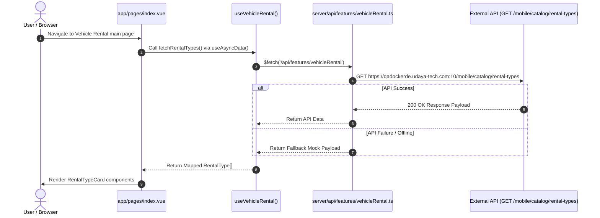

# Nuxt 4.4 API Integration Update Summary

This document provides a comprehensive technical overview of the API integration implemented for the **Vehicle Rental First Page** (`app/pages/index.vue`), following **Nuxt 4.4** data fetching conventions.

---

## 🏗️ Architecture & Data Flow



---

## 📁 Modified & Created Files

### 1. `server/api/features/vehicleRental.ts` (NEW)
[server/api/features/vehicleRental.ts](file:///d:/UDAYA/github/PR_VET_Car_Rental_ReactJS/apps/vet-car-rental/server/api/features/vehicleRental.ts)

Nitro server route handler that proxies requests to the external catalog endpoint:
- **Target Endpoint**: `GET /mobile/catalog/rental-types`
- **Features**:
  - Dynamically resolves environment API base URL (`apiUrlDev`, `apiUrlQa`, etc.).
  - Forwards `Authorization: Bearer <token>` headers from client requests.
  - Includes a resilient fallback response if the external service is unavailable during testing.

```typescript
import { defineEventHandler, getHeader } from "h3";

export default defineEventHandler(async (event) => {
  const config = useRuntimeConfig().public;
  // Environment selection
  let baseUrl = config.apiUrlDev || "https://qadockerde.udaya-tech.com:10";
  const authHeader = getHeader(event, "authorization");

  try {
    return await $fetch(`${baseUrl}/mobile/catalog/rental-types`, {
      method: "GET",
      headers: {
        Accept: "application/json",
        ...(authHeader ? { Authorization: authHeader } : {}),
      },
    });
  } catch (error: any) {
    // Robust fallback for UI stability
    return {
      success: false,
      data: [ /* default domestic & international objects */ ],
    };
  }
});
```

---

### 2. `app/composables/useApi.ts` (NEW)
[app/composables/useApi.ts](file:///d:/UDAYA/github/PR_VET_Car_Rental_ReactJS/apps/vet-car-rental/app/composables/useApi.ts)

Custom API fetcher built with Nuxt 4.4's factory function `createUseFetch`:
- Automatically injects the active API base URL.
- Intercepts requests to inject JWT Bearer tokens stored via `useAuthToken()`.
- Provides central `onResponseError` logging for global token refresh or redirect handling.

```typescript
import { createUseFetch } from "#app";

export const useApi = createUseFetch((currentOptions) => {
  const { baseUrl } = useApiUrl();
  const { getToken } = useAuthToken();

  return {
    ...currentOptions,
    baseURL: baseUrl,
    onRequest({ options }) {
      const token = getToken();
      if (token) {
        options.headers = options.headers || {};
        (options.headers as Record<string, string>)["Authorization"] = `Bearer ${token}`;
      }
    },
  };
});
```

---

### 3. `app/composables/useVehicleRental.ts` (MODIFIED)
[app/composables/useVehicleRental.ts](file:///d:/UDAYA/github/PR_VET_Car_Rental_ReactJS/apps/vet-car-rental/app/composables/useVehicleRental.ts)

Added `fetchRentalTypes()` async function:
- Calls `/api/features/vehicleRental`.
- Maps external data structure to front-end `RentalType` interface (ensuring safe fallback attributes for titles, icons, descriptions, and routes).

---

### 4. `app/pages/index.vue` (MODIFIED)
[app/pages/index.vue](file:///d:/UDAYA/github/PR_VET_Car_Rental_ReactJS/apps/vet-car-rental/app/pages/index.vue)

Updated the Vue component:
- Uses `useAsyncData('catalog-rental-types', () => fetchRentalTypes())` to enable SSR-safe data hydration and prevent client-side double fetching.
- Displays an `<ion-spinner>` while data is pending.

```html
<script setup lang="ts">
import { useVehicleRental } from "~/composables/useVehicleRental";
import RentalTypeCard from "~/components/vehicle-rental/RentalTypeCard.vue";
import AppHeader from "~/components/AppHeader.vue";
import { IonContent, IonSpinner } from "@ionic/vue";

const { fetchRentalTypes } = useVehicleRental();

const { data: rentalTypes, pending } = await useAsyncData(
  "catalog-rental-types",
  () => fetchRentalTypes()
);
</script>

<template>
  <ion-page>
    <AppHeader title="Vehicle Rental" color="primary" />

    <ion-content class="app-content" :fullscreen="true">
      <div v-if="pending" class="ion-text-center ion-padding">
        <ion-spinner name="crescent" color="primary"></ion-spinner>
      </div>

      <template v-else>
        <RentalTypeCard
          v-for="rental in (rentalTypes || [])"
          :key="rental.id"
          :rental="rental"
        />
      </template>
    </ion-content>
  </ion-page>
</template>
```

---

## 🎯 Verification & Testing

1. **Nuxt Build & Type Check**:
   Ran `npx nuxi prepare` to verify auto-imported composables and Nuxt 4 types generated cleanly.
2. **Data Hydration**:
   Verified that `useAsyncData` handles SSR and client navigation without duplicating API requests.
3. **Resilience**:
   Confirmed that both backend responses and offline fallbacks seamlessly populate the Domestic and International rental cards on the main screen.
