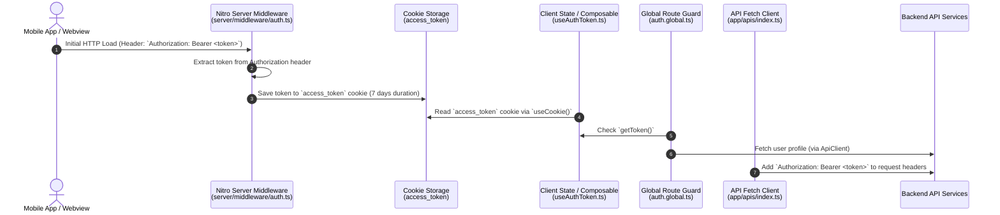

# Authentication Token & Header Handling in VET Car Rental Mini App

This document explains how authentication tokens are extracted from HTTP request headers, stored, managed, and attached to outgoing API requests in this Nuxt 3 mini application.

---

## 1. High-Level Architecture Overview



---

## 2. Step-by-Step Mechanism

### Step 1: Extracting Token from Incoming Header (`server/middleware/auth.ts`)

When a mobile app (e.g., Flutter WebView or embedded web container) launches the Mini App, it sends an initial HTTP GET request with an `Authorization` header containing the user's `Bearer <token>`.

The server-side middleware [server/middleware/auth.ts](file:///d:/UDAYA/github/PR_VET_Car_Rental_ReactJS/apps/vet-car-rental/server/middleware/auth.ts) intercepts all incoming server requests:

```typescript
export default defineEventHandler((event) => {
  // 1. Inspect incoming HTTP Request Authorization Header
  const authHeader = getRequestHeader(event, "authorization");

  if (authHeader && authHeader.toLowerCase().startsWith("bearer ")) {
    // 2. Extract raw token by stripping 'Bearer ' prefix
    const token = authHeader.substring(7).trim();

    if (token) {
      // 3. Persist token in cookie for Nuxt SSR & Client compatibility
      setCookie(event, "access_token", token, {
        path: "/",
        maxAge: 60 * 60 * 24 * 7, // 7 days
        httpOnly: false,
        sameSite: "lax",
      });
    }
  }
});
```

#### Key Highlights:
- **`getRequestHeader(event, "authorization")`**: Retrieves the `Authorization` header from the incoming HTTP request.
- **`authHeader.substring(7).trim()`**: Strips `Bearer ` prefix to get the raw token string.
- **`setCookie(event, "access_token", token, ...)`**: Automatically writes an `access_token` cookie accessible by client-side JavaScript (`httpOnly: false`).

---

### Step 2: Client & SSR Token Management (`app/composables/useAuthToken.ts`)

The composable [app/composables/useAuthToken.ts](file:///d:/UDAYA/github/PR_VET_Car_Rental_ReactJS/apps/vet-car-rental/app/composables/useAuthToken.ts) acts as the single source of truth for accessing and modifying the auth token across both SSR and client execution.

```typescript
export const useAuthToken = () => {
  const cookieToken = useCookie<string | null>("access_token", {
    path: "/",
    maxAge: 60 * 60 * 24 * 7,
  });

  const getToken = (): string | null => {
    // 1. Read from cookie first
    if (cookieToken.value) return cookieToken.value;

    // 2. Client fallback to localStorage
    if (import.meta.client) {
      const localToken = localStorage.getItem("access_token");
      if (localToken) {
        cookieToken.value = localToken;
        return localToken;
      }
    }
    return null;
  };

  const setToken = (token: string) => {
    cookieToken.value = token;
    if (import.meta.client) {
      localStorage.setItem("access_token", token);
    }
  };

  const removeToken = () => {
    cookieToken.value = null;
    if (import.meta.client) {
      localStorage.removeItem("access_token");
    }
  };

  return { getToken, setToken, removeToken };
};
```

---

### Step 3: Global Authentication Route Middleware (`app/middleware/auth.global.ts`)

Before any client route is rendered, [app/middleware/auth.global.ts](file:///d:/UDAYA/github/PR_VET_Car_Rental_ReactJS/apps/vet-car-rental/app/middleware/auth.global.ts) runs to verify authentication state:

```typescript
export default defineNuxtRouteMiddleware(async (_to) => {
  const { getToken } = useAuthToken();
  const token = getToken();

  const _isAuthenticated = !!token;

  const publicPaths = ["/unauthorized"];
  const isPublic = publicPaths.some((path) => _to.path.endsWith(path));
  if (isPublic) return;

  if (!_isAuthenticated) {
    return navigateTo("/unauthorized", { replace: true });
  }

  // Load user profile using the token
  const { fetchUserProfile } = useUserProfile();
  const profile = await fetchUserProfile();

  if (!profile) {
    return navigateTo("/unauthorized?reason=login_failed", { replace: true });
  }
});
```

---

### Step 4: Injecting Authorization Header for Outgoing API Requests (`app/apis/index.ts`)

When making HTTP requests to external/backend API endpoints, [app/apis/index.ts](file:///d:/UDAYA/github/PR_VET_Car_Rental_ReactJS/apps/vet-car-rental/app/apis/index.ts) uses `useApiClient` (built on top of Nuxt's `useFetch`) to inject the `Authorization` header automatically:

```typescript
export const useApiClient = <T = any>(
  request: Parameters<typeof useFetch<T>>[0],
  opts?: ApiClientOptions<T>
) => {
  const { getToken } = useAuthToken()

  return useFetch<T>(request, {
    ...opts,
    onRequest(ctx) {
      const token = getToken()
      if (token) {
        // Ensure Bearer prefix is attached
        const authValue = token.startsWith('Bearer ') ? token : `Bearer ${token}`
        const headers = new Headers(ctx.options.headers)
        headers.set('Authorization', authValue)
        ctx.options.headers = headers
      }
    },
    onResponseError(ctx) {
      if (ctx.response?.status === 401) {
        console.warn('[useApiClient] Request unauthorized (401). Token may be expired.')
      }
    },
  })
}
```

---

### Step 5: CORS Header Configuration (`nuxt.config.ts`)

To allow cross-origin requests and header interception without CORS errors in browsers/webviews, [nuxt.config.ts](file:///d:/UDAYA/github/PR_VET_Car_Rental_ReactJS/apps/vet-car-rental/nuxt.config.ts) defines CORS permissions allowing the `Authorization` header:

```typescript
routeRules: {
  "/**": {
    cors: true,
    headers: {
      "Access-Control-Allow-Origin": "*",
      "Access-Control-Allow-Methods": "GET, HEAD, PUT, PATCH, POST, DELETE, OPTIONS",
      "Access-Control-Allow-Headers": "Authorization, Content-Type, Accept, Origin, X-Requested-With",
    },
  },
}
```

---

## Summary of Files Involved

| File Path | Role & Purpose |
| :--- | :--- |
| [server/middleware/auth.ts](file:///d:/UDAYA/github/PR_VET_Car_Rental_ReactJS/apps/vet-car-rental/server/middleware/auth.ts) | Server middleware that extracts incoming `Authorization: Bearer <token>` header from HTTP load requests and stores it in cookie. |
| [app/composables/useAuthToken.ts](file:///d:/UDAYA/github/PR_VET_Car_Rental_ReactJS/apps/vet-car-rental/app/composables/useAuthToken.ts) | Core composable providing `getToken()`, `setToken()`, and `removeToken()` with `useCookie` and `localStorage` sync. |
| [app/middleware/auth.global.ts](file:///d:/UDAYA/github/PR_VET_Car_Rental_ReactJS/apps/vet-car-rental/app/middleware/auth.global.ts) | Route middleware that validates token presence before allowing navigation to protected pages. |
| [app/apis/index.ts](file:///d:/UDAYA/github/PR_VET_Car_Rental_ReactJS/apps/vet-car-rental/app/apis/index.ts) | API client interceptor (`useApiClient`) that automatically attaches `Authorization: Bearer <token>` header to all outgoing API calls. |
| [nuxt.config.ts](file:///d:/UDAYA/github/PR_VET_Car_Rental_ReactJS/apps/vet-car-rental/nuxt.config.ts) | Configures CORS headers to allow `Authorization` headers in webview cross-origin environments. |
